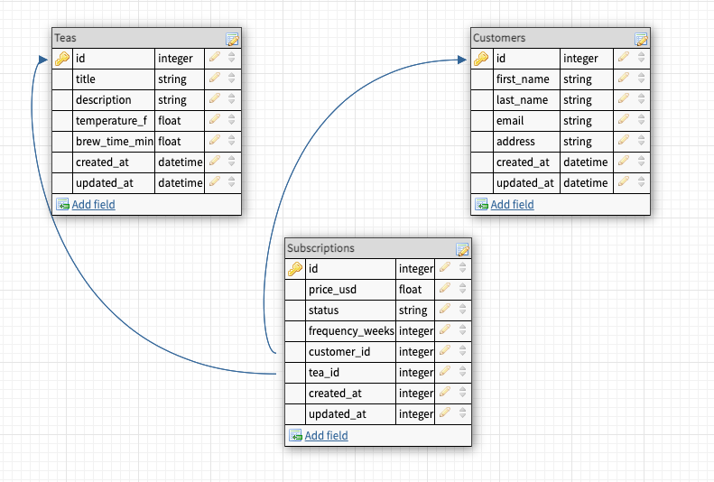

<div align="center">
  <h1>Tea Time API</h1>

</div>

<br>

# Table of Contents

- [Project Overview](#project-overview)
- [Learning Goals](#learning-goals)
- [Setup](#developer-setup)
- [Tech and Tools](#tech-and-tools)
- [Schema](#database-schema)
- [Endpoints](#endpoints)


# Project Overview

Tea Time is a solo built api that can be used for subscribing users(customers) to various teas. This Api was desgined to be as dynamic as possible. There can be various "subscriptions". Subscriptions can vary in frequency, and other factors could apply in future iterations for discounts, specials etc. Link to this assignment https://mod4.turing.edu/projects/take_home/take_home_be


# Developer Setup

1. Clone the respository
2. cd into the root directory
3. Install gem packages: `bundle install`
4. Setup the database: `rails db:{drop,create,migrate,seed}`
5. You may run the RSpec test suite locally with `bundle exec rspec`
6. Run `rails s` to use the localhost:3001 server

<br>

# Tech and Tools

## Built With

-  **2.7.2**
-  **5.2.8.1**
-  **3.12.0**
- 
- 


## Gems Used

- [Pry](https://github.com/pry/pry-rails)
- [RSpec](https://github.com/rspec/rspec-metagem)
- [Simple-Cov](https://github.com/simplecov-ruby/simplecov)
- [Factory Bot for Rails](https://github.com/thoughtbot/factory_bot_rails)
- [Faker](https://github.com/faker-ruby/faker)
- [Shoulda Matchers](https://github.com/thoughtbot/shoulda-matchers)


# Database Schema



<br>

# Endpoints


- The exposed endpoints are detailed below and can be run locally.

- Local Backend Server: http://localhost:3000


# Subscription Endpoints


## Add a subscription

Request: <br>
```
Post /api/v1/customer/1/subscription/1
```
Example:

JSON Response Example:
```
{
    "success": "New subscription of this tea added!"
}
```


<br>

## Cancel a subscription

Request: <br>
```
Patch /api/v1/customer/1/subscription/1/cancel
```
Example:

Request Body:
```json 
{
    "success": "This subscription has be successfully cancelled"
}
```

## All subscriptions of a user

Request: <br>
```
GET /api/v1/customers/1/subscriptions
```
Example:

Request Body:
```json 
{
    "data": [
        {
            "id": "1",
            "type": "subscription",
            "attributes": {
                "title": "once a month",
                "frequency_weeks": 4
            }
        },
        {
            "id": "2",
            "type": "subscription",
            "attributes": {
                "title": "twice a month",
                "frequency_weeks": 2
            }
        }
    ]
}
```


